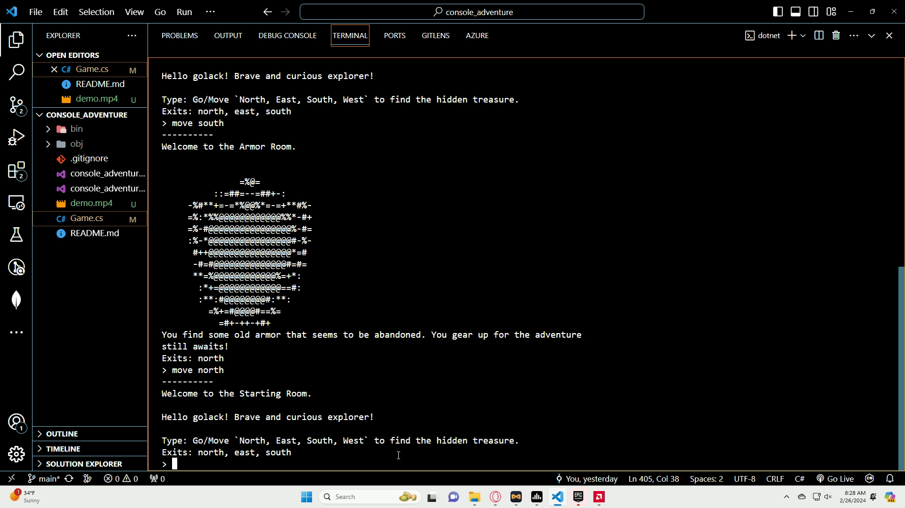

## Usage
1. Clone repository

- I used the `.NET` software development framework to run app using the command

2. `dotnet run`

## Demo

## Setting: 
A mysterious, ancient, and abandoned city filled with secrets and hidden treasures.

## Characters:
- The player: A brave and curious explorer seeking to uncover the city's secrets.
- The Oracle: A wise and enigmatic being who guides the player with cryptic clues.
- The Guardian: A powerful and ancient creature that protects the city's most valuable treasure.

## Story:
The player, a renowned explorer, receives a mysterious map that leads to an ancient, abandoned city rumored to hold an incredible treasure. Driven by curiosity and the promise of riches, the player sets out on an adventure to uncover the city's secrets and find the treasure.

As the player explores the city, they encounter the Oracle, who provides cryptic clues and hints to help them navigate the city and avoid its many dangers. The player must solve puzzles, overcome challenges, and make choices that will ultimately determine their fate.

At the heart of the city lies the Guardian, a powerful and ancient creature that protects the city's most valuable treasure. The player must use their wits, intelligence, and the Oracle's guidance to overcome the Guardian and claim the treasure.

With a rich setting, intriguing characters, and an engaging story, this text-based adventure game promises to be an exciting and immersive experience for players.